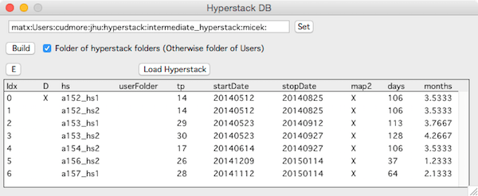

Hyperstacks are loaded, saved, and visualized through the Hyperstack panel.

<figure>

</figure>

<strong>Tip:</strong> If you lose the hyperstack panel, it can be reopened with menu Hyperstack -> Hyperstack Panel

####Loading a hyperstack
Press the 'Load' button and select the _T.ibw file corresponding to the hyperstack to be loaded.  

If the hyperstack to load is a153_hs2 then load the file 'a153_hs2_T.ibw'  

####Saving a hyperstack
- Select a hyperstack in the list
- Click the 'Save' button
- The hyperstack is saved in the same hard-drive folder it was opened from.

<strong>important:</strong>
There is no 'Save As...'

####Opening a [stack][1] window for a single timepoint
1. select a hyperstack in the list
2. fill in the timepoint
3. click 'Stack' button.

<strong>important:</strong>
Only one timepoint can be viewed at a time with the 'Stack' button. To view another timepoint, close the current timepoints stack window and open another timepoint.

####Opening [Find Points][1] to connect nodes and edges from one timepoint to the next
- Enter two sequential timepoints in 'Timepoint' and 'Timepoint 2'
- Click 'Find Points' button
- See [Find Points][1]

####[Search][3]

Open a panel to search nodes, tubes and slabs

####Unload stacks

- Unload raw data from selected hyperstack.

<strong>Important:</strong>
Image stacks take up memory. If too many are loaded, Igor will run out of memory. To prevent this, unload unused stack images with 'Unload Stack'. The next time a stack is to be displayed it will automatically be loaded again.

####List

Open a List panel to display a list of all timepoints in a hyperstack

####Hyperstack database (HS DB)

Open a panel to display a database of all hyperstacks in a hard-drive folder

<figure>

</figure>

In the Hyperstack DB panel, 'set' a hard-drive folder and press the 'Build' button to generate a list of all hyperstacks in the selected hard-drive folder.

Double-click on a hyperstack in the list and it will load into the main Hyperstack panel.

There are two ways of generating the list

- Check 'Folder of hyperstack folder' expects a folder which itself contains hyperstack folders. This normally corresponds to a user folder such as 'cudmore' or 'jahnavi'.
- Do not check 'Folder of hyperstack folder' expects a folder of user folders.

The list of hyperstacks has the following information

- hs : Name of hyperstack
- userFolder : The user folder the hyperstack is in (if using 'Folder of users')
- tp : Number of timepoints
- startDate : The first date in the hyperstack
- stopDate : The last date in the hyperstack
- days : The number of days in the hyperstack (number of days between start and stop)
- months : The number of months in the hyperstack (stop date - start date)

[1]: /Vascular-Analysis/find-points/ "find-points"
[2]: /Vascular-Analysis/stack/ "stack"
[3]: /Vascular-Analysis/search/ "search"
