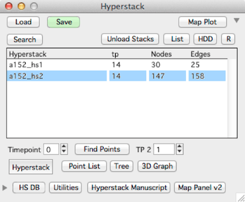

Hyperstacks are loaded, saved, and visualized through the Hyperstack panel.

####Loading a hyperstack
Press the 'Load' button and select the _T.ibw file corresponding to the hyperstack to be loaded.  

If the hyperstack to load is a153_hs2 then load the file 'a153_hs2_T.ibw'  

####Saving a hyperstack
- Select a hyperstack in the list
- Click the 'Save' button
- The hyperstack is saved in the same hard-drive folder it was opened from.

####Opening a stack window for a single timepoint
1. select a hyperstack in the list
2. fill in the timepoint
3. click 'Stack' button.

####Notes
- Only one timepoint can be viewed at a time with the 'Stack' button.
- There is no 'Save As...'

<strong>Tip:</strong> If you lose the hyperstack panel, it can be reopened with menu Hyperstack -> Hyperstack Panel

