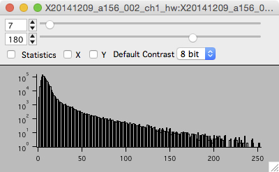
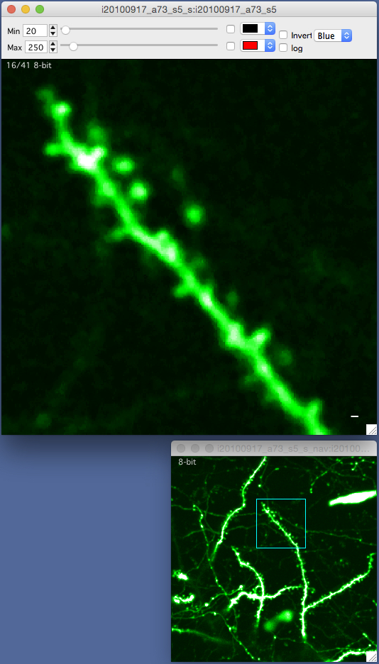
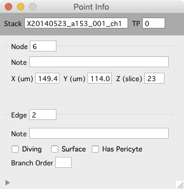

* Table of Contents Placeholder
{:toc}

Each timepoint is a 3D volume (a stack).  

####Examples

<figure>

<figcaption>Two example stacks. Dendritic spines (left) and vascular tubes (right).</figcaption>
</figure>

<figure>
</figure>

####Interface
- Mouse wheel to scroll up and down through images
- Image contrast is critical, set it with the sliders.
	Oen and close contrast bar with keyboard 'c'
- View a histogram with keyboard 'h'
	
####Keyboard commands
	Arrow keys to pan left/right and up/down in the image  
	+/- keys to zoom in/out  
	Return/Enter keys to zoom all the way out  
	
	Left mouse button to select objects
	Esc : Cancel selection

	1 : view channel 1 
	2 : view channel 2 

	3 : view a sliding maximal z-projection of channel 1 
	4 : view a sliding maximal z-projection of channel 2 

    c : toggle contrast control bar
    h : open histogram window
    ] : toggle between two different window sizes
    
    sift+c : cycle through 4 different window 'candy' displays
    
    shift+p : Set pixel/voxel size
    
	shift+? : open the 'Point Info' window  
		Object notes can be set in the Point Info window.  

<figure>

</figure>

####Histogram

- Open the histogram window with keyboard 'h'.
- The histogram window shows a pixel intensity histogram for one image.
- Scroll through the image and the histogram for each image will be show.

 
 

####Navigation window

<figure>

</figure>

- Right click and select 'Navigation Window' menu. A navigation window will be opened and your current zoomed view of the stack will be shown as a blue square.
- Zoom with +/- or pan with arrow keys and the blue-square tracks what you are looking at.
- The navigation window is, by default, a maximal z-projection of the entire stack.

 
 
 
 
 
 
 
 
 
 
 
 
 
 
 
 
 
 
 
 
 

####Point info

The Point Info window shows information about the currently selected object.  

Open the Point Info window from any stack window using shift+?.  

Use the point info window to annotate either nodes or edges with notes.

Use the point info window to annotate edges as 'diving', 'surface', 'Has Pericyte' and 'Branch Order'.

####Notes
- Closing a stack window does not remove the stack from memory.

[1]: /Vascular-Analysis/hyperstack-panel/
