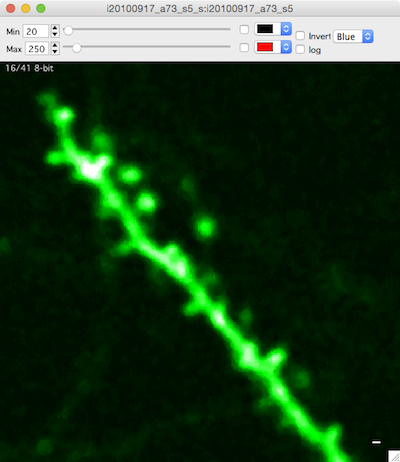

<H2>Stack</H2>

* Table of Contents Placeholder
{:toc}

####Overview
- Mouse wheel to scroll up and down through images, arrow keys to pan, +/- to zoom
- Image contrast is critical, open contrast bar with keyboard 'c', adjust min/max contrast with sliders.
- View a histogram with keyboard 'h'
- Closing a stack window does not remove it from memory (the stack remains open)
	
####Keyboard commands
	Arrow keys : pan image left/right and up/down  
	+ : zoom in (follows mouse pointer) 
	- : zoom out (follows mouse pointer) 
	Return/Enter : view entire image  
	
	Esc : cancel selection

	1 : view channel 1 
	2 : view channel 2 

	3 : view a sliding maximal z-projection of channel 1 
	4 : view a sliding maximal z-projection of channel 2 

    c : toggle contrast control bar
    h : open histogram window
    ] : toggle between two different window sizes
    
    sift+c : cycle through 4 different window 'candy' displays
    
    shift+p : Set pixel/voxel size
    
	shift+? : open the 'Point Info' window  
		Object notes can be set in the Point Info window.  

####Contrast bar
- Open the contrast bar with keyboard 'c'
- Pixel intensity values below 'min' will be displayed as black
- Pixel intensity values above 'max' will be displayed as white

####Histogram

The histogram window show a histogram of pixel intensity values for each image in a stack.

- Open the histogram window with keyboard 'h'.
- The histogram window shows a pixel intensity histogram for one image.
- Scroll through the image in a stack (mouse-wheel) and the histogram for each image will be show.

####Navigation window

The navigation window opens a new window with a maximal z-projection of the stack and shows the current zoomed view as a blue square.

- Right click and select 'Navigation Window' menu. A navigation window will be opened and your current zoomed view of the stack will be shown as a blue square.
- Zoom with +/- or pan with arrow keys and the blue-square tracks what you are looking at.
- The navigation window is, by default, a maximal z-projection of the entire stack.

####Point info

The Point Info window shows information about the currently selected object.  

- Open the Point Info window from any stack window using shift+?.  
- Use the point info window to annotate either nodes or edges with notes.
- Use the point info window to annotate edges as 'diving', 'surface', 'Has Pericyte' and 'Branch Order'.

####Important
- Contrast is critical, if not set properly you will not see objects in your image that are actually there.
- Closing a stack window does not remove the stack from memory.
- Zooming with keyboard +/- follows the mouse pointer

[1]: /Vascular-Analysis/hyperstack-panel/
