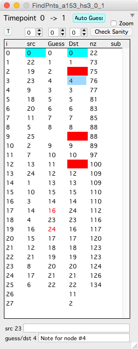
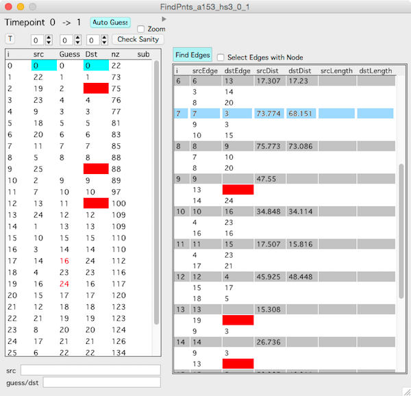

<B>Tip: </B> Don't be discouraged here. The Find points interface is actually very easy and intuitive to use. It is only the description on this page that is hard to understand.

The Find Points window will display two timepoints simultaneously and provides an interface to manage the connections between both nodes and edges across timepoints.  

Open Find Points from the main [Hyperstack Panel][1] by specifying 'Timepoint' and 'Timepoint 2'. Select a row in Find Points and both the source and destination stacks will be opened.

<B>Important: </B> When you first click a row in the Find Points window, you are opening two image stacks. This will take some time. Let the program finish opening the stacks before you continue interacting with the interface.

####Interface

<figure>

</figure>

On the right is an example Find points window with Src node 23 connected to Dst node 4.

The Find Points window displays a list of nodes in the source timepoint (Src column). For each node in the source timepoint, Find Points shows the corresponding connected node (if there is one) in the second timepoint (Dst column).

The Guess column shows the best guess for the corresponding node in the second timepoint. This guess is generated using each timepoints [Pivot point][2].

Once a node is selected, the keyboard can be used to scroll through the nodes in the Find Points list and nodes will be selected simultaneously in both the source and destination image stacks.

For each row:

- Blue : Denotes the [Pivot Point][2] for the Src and Dst timepoints
- Red (Dst) : Denotes a Src node that is missing a Dst node
- Red (Guess) : Denotes a Guess that differs from the assigned Dst
- Only Dst is filled in : Denotes a Dst node that has no matching Src node (reverse lookup)

####Keyboard commands

- Up arrow : Go to the previous node
- Down arrow : Go to the next node
- Left arrow : Flash the Src node (in first timepoint) and Guess node (in second timepoint).
- Right arrow : Flash the Src node (in first timepoint) and Dst node (in second timepoint).
- shift + right-arrow : Transfer the Guess node to Dst node
- Del : Delete the Dst node (not the node itself, just the correspondence)

###Nodes

The goal is to fill in the Dst column with the correct nodes, e.g. a mapping of each node in the Src timepoint with a node in the Dst timepoint.

The 'Guess' column is the programs best guess for which nodes are connected. This guess is created using [Pivot Points][2].

Scroll through each source node in the Find points window and do one of the following:

- If the Guess is correct, transfer the Guess to the Dst with keyboard 'shift + right-arrow'. That is 'hold shift and hit the right-arrow'. This will fill in the Dst with the Guess.
- If the Guess is not correct, go to the image stacks and select the source node and the destination node to connect (in their respective image stacks) and right-click on the destination node (still in the image stack) and select menu 'FindPnt -> Dst'.
- Use 'Del' key to remove a node from the Dst column.

If a node in the second timepoint does not have a match in the first timepoint it is appended to the end of the list. This node can be selected as usual and allows for a reverse lookup from the second timepoint to the first.

While you are editing the connections between nodes using Find points you can always add new nodes, edges and slabs as you find nodes in one timepoint that need to be created in the other.

###Edges

<figure>

</figure>

Expand the Find Points window with the disclosure triangle (top right of the window) to display a list of edges. The navigation in this list of edges is similar to that of nodes.

On the right is an example Find points window showing the edge interface. Each edge gets three rows:

- <B>Row 1 (gray):</B> Gives the edge index in the first (srcEdge) and second (dstEdge) timepoints. If dstEdge is empty, there is no mapping from the given src timepoint edge (srcEdge) to the dst timepoint.
- <B>Row 2:</B> The corresponding nodes in the first timepoints. The nodes that make up the srcEdge.
- <B>Row 3:</B> The corresponding nodes in the second timepoint. The nodes that make up the dstEdge.
  
For a given edge, edge #9 in this example, any red cells indicates that the edge is only partially formed. For edge #9, one of the nodes is not mapped correctly. You can switch back to the node list and make sure that each node in the src edge has a mapping to the second (dst) timepoint.

You don't actually edit the connections between edges as you do with nodes, you edit the connections between nodes and the edges will follow. This works because we only allow one edge between any two nodes (think about it).

###Nodes and edges

As you discover missing nodes and edges, you can go back to the image stacks and make the appropriate edits. For example, you can make entire new edges if your missing an edge in either the first or second timepoint, connect the nodes together with Find points (nodes) and the edges (still in Find points) will magically be connected.

[1]: /Vascular-Analysis/hyperstack-panel/
[2]: /Vascular-Analysis/pivot-points/ "Pivot Points"
