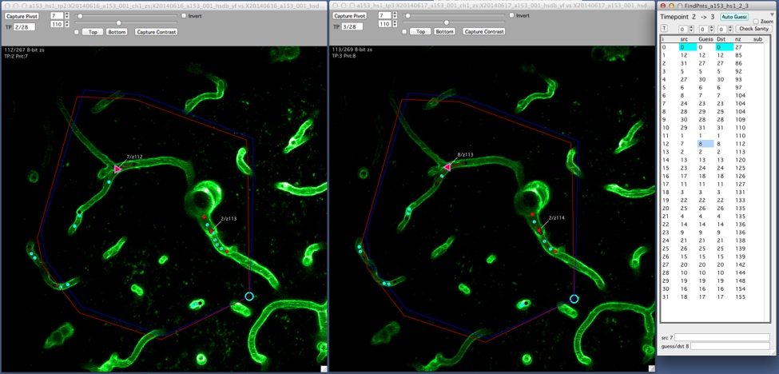
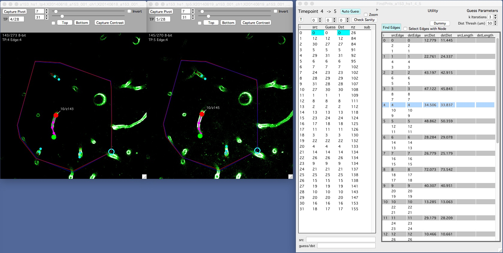

The Find Points window allows nodes and edges to be connected between two sequential timepoints in a hyperstack.  

Open Find Points for a source and destination timepoint in the main [Hyperstack Panel][1].  

The Find Points window has a list of nodes in the source timepoint (one row per node) and shows the matching nodes in the second timepoint.

Click a node row in the find points window and it will open the two timepoints side-by-side.

When you first click a node row in the Find Points window, you are opening two image stacks. This will take some time. Let the program finish opening the stacks before you continue interacting with the interface.

###Nodes

<figure>

<figcaption>Find Points for nodes with Src node 7 connected to Dst node 8.</figcaption>
</figure>

The goal is to fill in the Dst column with the correct nodes, e.g. a mapping of each node in the Src timepoint with a node in the Dst timepoint.

Find Points will show you a list of nodes in the first timepoint (Src) with their corresponding connection in the second timepoint (Dst).

When you first open Find Points there will be no Dst nodes filled in, that is your job.

The 'guess' column is the programs best guess for which nodes are connected. This guess is created using [Pivot Points][2].

You basically have two choices for each Src node:

- If you like the Guess, transfer the Guess to the Dst by selecting the row in Find Points and using keyboard 'shift + right-arrow'. That is 'hold shift and hit the right-arrow'.

- If the guess is not to your liking, select the source node and the destination node to connect (in their respective image stacks) and right-click on the destination node (still in the image stack) and select menu 'FindPnt -> Dst'.

Scrolling through the list will highlight nodes in the Src and Dst at the same time. Once a row is selected, left-arrow will flash the Guess and right-arrow will flash the Dst.

If a node in the second timepoint does not have a match in the first timepoint it is appended to the end of the list. This node can be selected as usual and allows for a reverse lookup.

####Put another way

For each source node in the first time point (src) there is a guess telling us the node it potentially matches in the second timepoint (Guess).  The goal here is to fill in the proper connection/correspondence  by filling in the proper destination node (Dst). In most cases, when the guess is correct this is done by simply copying the Guess to the Dst. If the Guess is not correct, the user selects the proper destination node (in the second timepoint) and using a right-click selects ‘Connect Nodes’.

###Edges

<figure>

<figcaption>Find Points for edges with Src edge 4 connected to Dst edge 4.</figcaption>
</figure>

Expand the FInd Points window with the disclosure triangle (top right of the window) to see a similar list for edges.

Edges in red are edges that have a mismatch between their starting and ending nodes.

You don't actually edit the connections between edges, you edit the connections between nodes and the edges will follow. This works because we only allow one edge between and two nodes (think about it).

Goal is to modify your node connecitons until the edges are as good as they can get.

[1]: /Vascular-Analysis/hyperstack-panel/
[2]: /Vascular-Analysis/pivot-points/ "Pivot Points"
