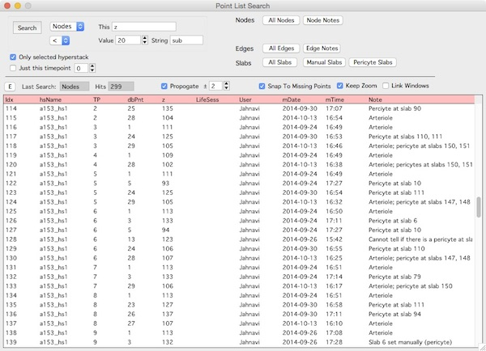

The search panel will search for nodes, edges and slabs. It will search over all open hyperstack, just one hyperstack and across multiple timepoints or just one timepoint.

Open the search panel from the main [hyperstack panel][2]

Once a search is performed, clicking on a row in the results will bring up that object in a [stack][1].

[1]: /Vascular-Analysis/stack/ "stack"
[2]: /Vascular-Analysis/hyperstack-panel/ "hyperstack-panel"
