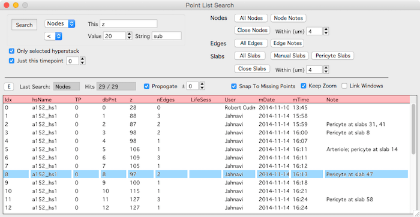

The search panel will search for nodes, edges and slabs. It will search over all open hyperstack, just one hyperstack and across multiple timepoints or just one timepoint.

Open the search panel from the main [hyperstack panel][2]

Once a search is performed, clicking on a row in the results will bring up that object in a [stack][1].

The extend of the search can be limited using the two checkboxes  

- 'Only selected hyperstack' will limit the search to the hyperstack selected in the main Hyperstack panel
- 'Just this timepoint' will limit the search to the specified timepoint

####Nodes

- All nodes : Return all nodes
- Node notes : Return nodes with textual notes
- Close nodes : Return nodes that are close to other nodes

####Edges

- All edges : Return all edges
- Edge notes : Return edges with tectual notes

####Slabs

- All slabs : Return all slabs
- Manual slabs : Return slabs marked as manual
- Pericyte slabs : Return slabs marked as pericyte
- Close slabs : Return slabs that are close to other slabs

[1]: /Vascular-Analysis/stack/ "stack"
[2]: /Vascular-Analysis/hyperstack-panel/ "hyperstack-panel"
