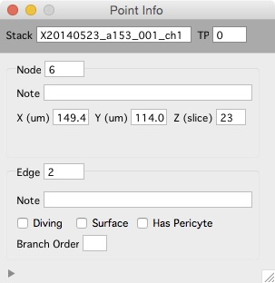

The Point Info window shows information about the currently selected node and edge.  

Open the Point Info window from any image [stack][1] using shift+?.  

Use the point info window to annotate either nodes or edges with notes.

Use the point info window to annotate edges as 'diving', 'surface', 'Has Pericyte' and 'Branch Order'.

[1]: /Vascular-Analysis/stack/ "stack"