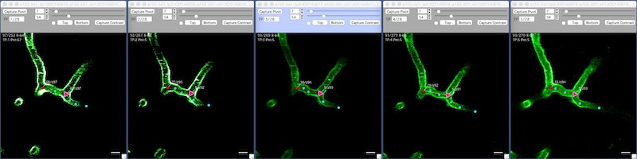
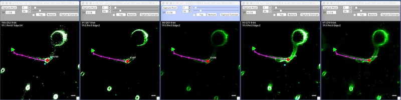

A run follows an object (a node or edge) through multiple timepoints.

The easiest way to open a run is to click on an object in the [Search][1] window.

####Node Run

####Edge Run

[1]: /Vascular-Analysis/search/
