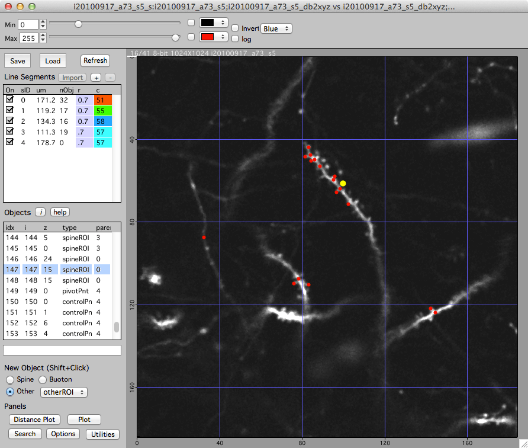
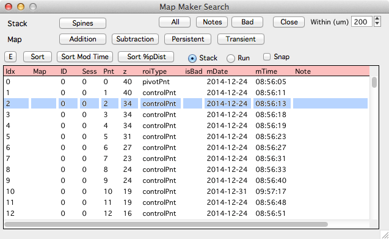
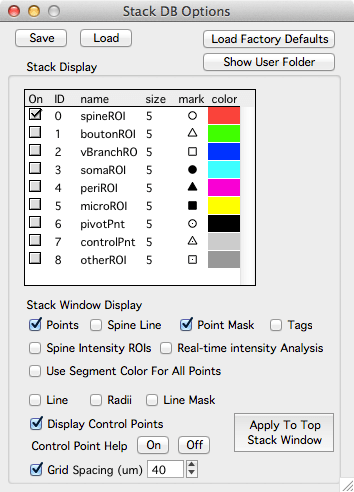

###Workflow

This documents describes a very simple workflow for annotating 3D points in a stack.

####1. Open and initialize bStack

- Open bStack.ipf in Igor Pro (double-click the bStack desktop icon).
- Click in the Igor Pro command window to compile (the command window is titled 'Untitled').
- <b>Important:</b> Initialize bStack using menu 'bStack -> Load User' and select <b>'yunju_branch_points.txt'</b>  
    This will open the [Stack Browser][2] window

####2. Load a stack
- Either  
    Drag and drop a .tif stack onto the Stack Browser.
- Or  
    Load a directory of .tif files using the 'Load Generic Directory' button.

Once a stack is loaded in the [Stack Browser][2], double-click on its entry to display the stack in a [Stack][1] window.

You need to set the proper X/Y/Z stack scale with keyboard 'shift+p'. If you make stack db points with the wrong scale, you need to come find Bob.

####3. Add 3D annotations

Each stack can have a list of 3D annotations, we call this a stack database (stack db).

- In a [stack][1] window, open the stack db toolbar with keyboard '['.
- Add a new 3D point with shift+click.
- Delete a point by selecting the point (mouse left-click) and hitting keyboard 'Delete' or 'Backspace'.
- Each point can have a textual note, select the point and fill in a note in the field below the list of points.

####4. Save your work

- Save a stack db using the 'Save' button.
- Load a previously saved stack db with the 'Load' button.
- <b>Important:</b> You are responsible for saving your stack db. Use the 'Save' button.

###Details

####Stack scale

Set the X/Y/Z stack scale in the main stack window with keyboard 'shift+p'.

Please set the proper scale before you make any stack db points.

If you create stack db points and later need to change the scale <b>you need to come see Bob</b>.

####Exporting data

It is very easy to export the 3D coordinates of the points in a stack DB.

- Option 1: In the stack db toolbar of the main stack window, click on the list of points and then press keyboard 'e'. This will open a text table of all points in the stack db, you can copy and paste it into your favorite analysis program.

- Option 2: When you save a stack db you are saving all the points in a single text file. The file can be found in a folder named 'stackdb' in the hard-drive folder of your original stack.

####Stack DB toolbar

The stack db toolbar displays a list of line segments and a list of points. Open and close the stack db toolbar with keyboard '['.
 
#####Line Segments

Selecting a line segment in the list will select the same line segment in the stack window and vica-vera.

#####Points

Selecting a point in the list will select the point in the stack window and vica-versa.

####Search panel

Open the Search panel from the stack db toolbar using the 'Options' button.

The search panel will search a stack db and return a list of points. Once generated, clicking on a point in the search results will display the point in the main stack window.

Different types of searches are performed with buttons:  

- All : Generate a list of all stack db points.
- Notes : Generate a list of stack db points with notes.  
- Close : Search for points that have other points that are close.

Once a search is performed, the search panel will display a list of results. Each row in the list of results is a point in the stack db. Single-click on a point in the list and it will be selected in the main stack window.

If you zoom the stack window (keyboard +) you can snap to different points while maintaining the zoom using the search panel 'Snap' checkbox.

The search results are a static output report. Once a search is performed, if points in the main stack window are modified (add, delete, move) the search results will not be automatically updated. If the points are modified in the main stack window and you want to use the search results, regenerate the search.

####Options panel

Open the Options panel from the stack db toolbar using the 'Options' button.

<b>Grid Spacing (um)</b>: Toggles a grid on and off in the main stack window. When the grid is turned on/off or the scale is set, the main stack window is not automatically updated. Close and re-open the main stack window to refresh the grid.

[1]: /Vascular-Analysis/stack/
[2]: http://www.robertcudmore.org/maptracker/v2/stack-browser/
